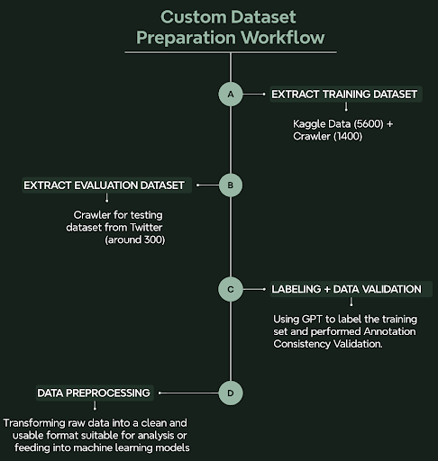
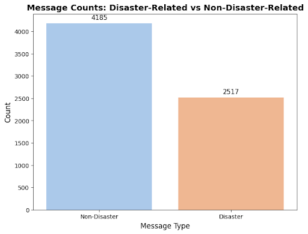
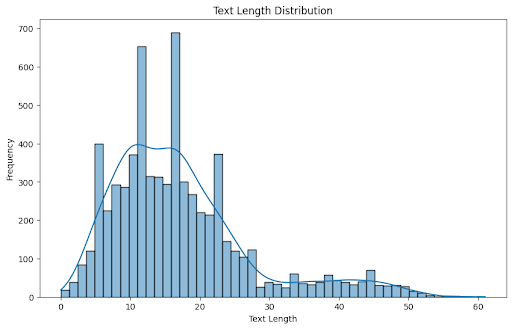
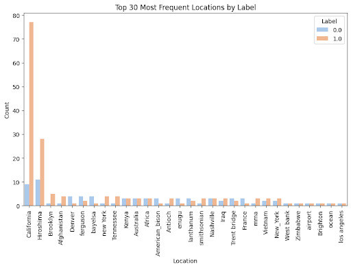
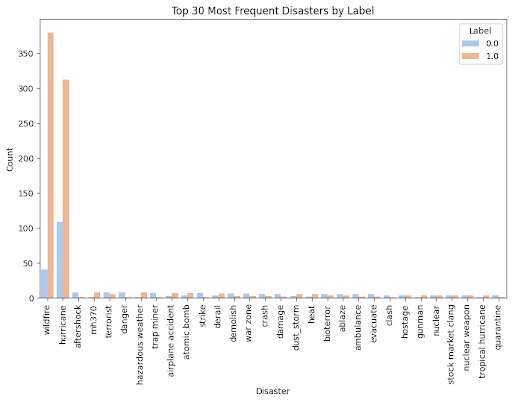
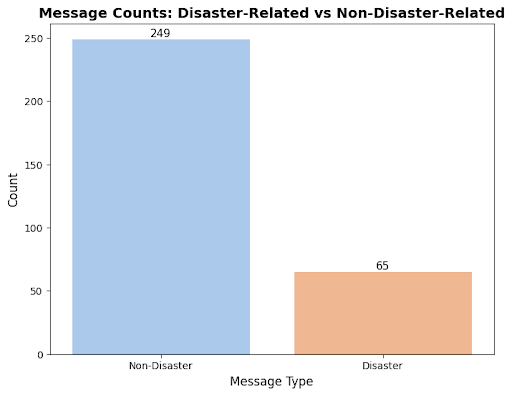
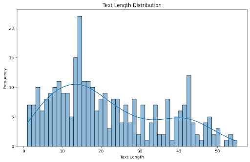

# disaster_Prediction
This is a Final Project of ISE540 in USC which is about the NLP(Natural Language Processing).

## Project Description
I get the topic from a [kaggle competiition](@https://www.kaggle.com/c/nlp-getting-started) which is a simple binary classification.

Although it is just a final project of the class, I think it is a good opportunity to follow a real workflow used in the industrial field.

The workflow is as follow:

**Dataset** -> **Data Preprocessing** -> **Annotation(Labeling)** -> **EDA** -> **Model Selection** -> **Model Fine-tuning** -> **Evaluation** 

I will introduce what we have done in each part and break them down. Hope it will help you to understand our project and code.

## BreakDown Details

### 1. Datasets
Data Source: Twitter Texts

Approach: Web crawler

Sample_count: 1400+5600(dataset from kaggle) = 7000

#### Brief Explanation:

##### Web Crawler
In this part, we use **web crawler** to get some Twitter Texts. Because I am not familiar with the web crawler and the operation of how to transfer the web data, I find the code on the *Bilibili* which is a Chinese video platform. Some details are expained in the [video](https://www.bilibili.com/video/BV1mx4y1t7Uo/?spm_id_from=333.1007.top_right_bar_window_history.content.click&vd_source=e4945a960ebe99f5b861521b8f23add7) ([code](https://gitee.com/wojiaoyishang/get-tweets))

Statement: *The tweet contents are for performance purposes only and are not used for commercial purposes.*

#### Evaluation Dataset
The evaluation dataset consists of 314 crawled tweets. To ensure the dataset includes disaster-related tweets without directly 
searching for specific disaster-related keywords, a Twitter account following several news and climate-related public accounts was used. 
Recommended tweets from these sources were crawled without reliance on keyword-based searches, resulting in a broader and less biased 
dataset for evaluation.

### 2. Data Preprocessing

In the tweet texts, there are several elements that can be deleted.

#### 2.1. url

> "AWP Wildfire FN Giveaway! (227 Big Coins)
> Retweet
  Follow me & 
  @csgobig
>  
>    Follow http://kick.com/csgobig (optional)
>    
>    Winner will be picked in 7 days! "

#### 2.2. Non-English word

> like Chinese, Japanese and some other language.
>

#### 2.3. some punctuations
> like ... , \n , | , - 

### 3. Annotation

In this part, in order to increase our efficiency, we use ***GPT-4o*** to help us to do the labeling task.

### 4. EDA

#### 4.1 Training Dataset

***label distribution* and *sentence length***

  
  

***Location* and *Disaster* distribution**

  
  

#### 4.2 Evaluation Dataset

***label distribution* and *sentence length***

  
  

### 5. Model Selection

Because this class is an NLP class, we want to try different kinds of models to solve the problem. Our logic is that we seperate the all NLP models into two categories. One is model for **<u>NLU (Natural Language Understanding)</u>** and another is model for **<u>NLG (Natural Language Generation)</u>**

#### 5.1. NLU

In this field, we think that the model related to the NLU tasks is like BERT and different optimized version of [BERT](https://arxiv.org/abs/1810.04805) such as [RoBERTa](https://arxiv.org/abs/1907.11692), [ALBERT](https://arxiv.org/abs/1909.11942), [DeBERTa](https://arxiv.org/abs/2006.03654) and etc.

In this case, we choose two famous models in the BERT family, the one is **RoBERTa** (I think it is the most famous optimized version of BERT) and another one is **DeBERTa** (the state-of-art model in NLU). 

#### 5.2. NLG

The hottest topic of AI field is LLM (Large Language Model). Therefore, the application of LLM should be considered when we talk about the NLG. 

There are many companies try to make their own LLM to have a better performance such as OpenAI, Antropic, Meta, Mistral AI, Alibaba, Baidu and etc. At the same time, many companies have made their own LLM open-sourced (except 'Open'AI), which helps many start-up companies or individual to develop their own LLM, application, software and etc..

For our project, we are going to use the [<u>**Llama3.1-8B-Instruct**</u>](https://huggingface.co/meta-llama/Llama-3.1-8B-Instruct) and [<u>**Llama3.2-3B-Instruct**</u>](https://huggingface.co/meta-llama/Llama-3.2-3B-Instruct). These two models represent two main approaches for people to use LLM. The 8B model and 3B model represent Cloud and edge-device respectively.

### 6. Fine-tuning

#### BERT-based model 
The fine-tuning process for RoBERTa and DeBERTa models focused on disaster-related tweet classification and employed strategies to mitigate overfitting while optimizing performance.
Addressing Overfitting

##### Address and Prevent Overfitting:
* Batch Size Adjustment: 
      The batch size was tuned to balance gradient stability and overfitting prevention.
* Using max_steps: 
      Training was controlled using max_steps rather than epochs, enabling early stopping and finer control over progress.

#####  Implementation Details:
* A custom compute_metrics function was implemented to evaluate model performance, providing tailored metrics for disaster-related tweet classification.

* Regularization was supported through the models' dropout layers. No further parameters were used.

#### LLM

LLM SFT: [LLaMA-Factory](https://github.com/hiyouga/LLaMA-Factory) (**Excellent** open-sourced platform for LLM SFT)

GPU: 4 ✖️ RTX4090

Technique:
1. LoRA
2. Deepspeed
3. Flash Attention

### 7. Evaluation
| index  |        model name          |  Acc  |  Recall  | Precision | F1 | infer speed(s/item) |
|:------:|:---------------------------|:-----:|:--------:|:---------:|:--:|:-------------------:|
|   1    | DistllBERT                 | 0.86  |   0.98   |    0.62   | 0.76 |**0.004**          |
|   2    | RoBERTa (125M)             | 0.86  |   0.98   |    0.59   | 0.74 | 0.006             |
|   3    | DeBERTa (184M)             | 0.86  |   0.85   |    0.91   | 0.86 | 0.008             |
|   4    | [Llama3.2-1B-Instruct](https://huggingface.co/Frank0219/Llama3.2-1B-Instruct_for_disaster_prediction)       | 0.86  |   0.88   |    0.79   | 0.82 | 0.5               |
|   5    | Llama3.2-3B-Instruct(infer)| 0.85  |   0.87   |    0.77   | 0.80 | 0.8               |
|   6    | [Llama3.2-3B-Instruct](https://huggingface.co/Frank0219/Llama3.2-3B-Instruct_for_disaster_prediction)       | 0.87  |   0.91   |    0.80   | 0.83 | 0.8               |
|   7    | Llama3.1-8B-Instruct(infer)| 0.89  |   0.92   |    0.82   | 0.85 | 1.1               |
| **8**  | **Llama3.1-8B-Instruct**   |**0.90**| **0.93**|  **0.83** |**0.87**|  1.1            |

### 8. Future work and Limitation
#### Limitation
1. Ground truth Problem

      Although the labeling is acceptable(based on pypothesis test), there are some wrong ground truth in our training dataset.

2. Inference Speed Limitation

      the model selection needs to consider the **real-world situation**.

* Emergency -> quick response -> BERT-based model (DistillBERT, RoBERTa) 

* not Emergency -> high accuracy -> LLM 

3. The performance of LoRA is still worse than full-parameters SFT

4. Hallucination Problem

Especially in the Application of our SFT model.

#### Future Work
1. Location and Disaster Recognition (NER)
2. More Evaluation Dataset

      The result demonstrates that the improvement is obvious between BERT-based model and LLM. However, there is only tiny difference between BERT-based model. Therefore, the number of Evaluation Dataset is also a feature is worth considering. 

3. LLM Deployment on Edge-Device

      I think there are two main approaches to run a LLM on the edge-device such as Iphone, Ipad, Mac or even a watch.
- API 

* Local Inference

     Fortunately, I have made a demo to use the same inferface with ChatGPT and use the API to realize the run of LLM. 
      
     However, There are many problems and unkown knowledge for me to make an APP which enable to run LLM locally. 

     I found some good open-source engine and swift package about how to apply [llama.cpp](https://github.com/ggerganov/llama.cpp)(a famous local inference function) on the edge-device including:
      
     1. [llm-core](https://github.com/guinmoon/llmfarm_core.swift) (the engine of [LLMFarm](https://github.com/guinmoon/LLMFarm?tab=readme-ov-file))
     2. [swiftLlama](https://github.com/ShenghaiWang/SwiftLlama)

### 9. [App development](https://github.com/ZeweiXu0219/llm-app)